# Architectures Micro-services

### 1. Teste de la couche DAO
A partir du lien http://localhost:1997/h2-console on genere l'interface de la base de donnees. La figure suivante presente cette interface.

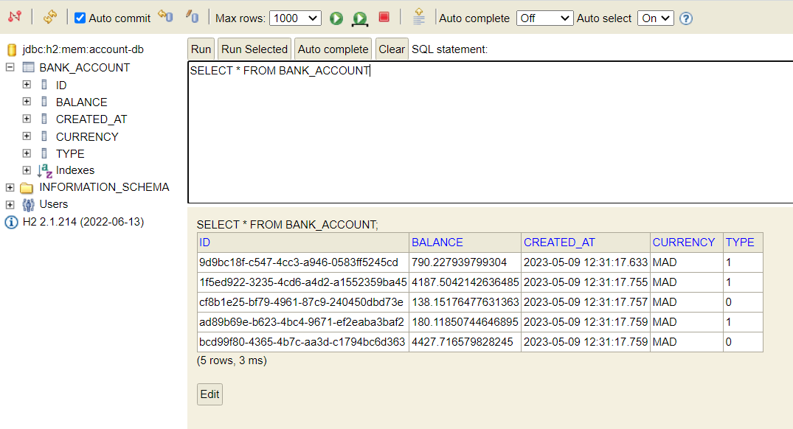

### 2. Teste du web micro-service en utilisant un client REST comme Postman
La figure ci-dessus represente la liste des clients generes en utilisant REST, cette est accessible via le lien http://localhost:1997/bankAccounts.
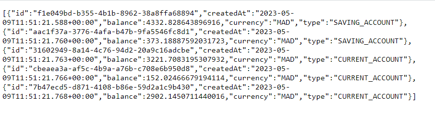
Avec le logiciel Postman nous permettant de tester les differentes fonctions du REST. Les figures qui suient presentent les differentes fonctions comme obtenir la liste de client ou un client a partir de son id, ainsi que ajouter ou modifier un client.

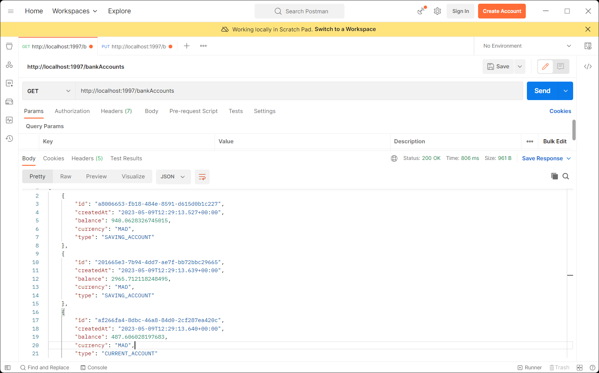
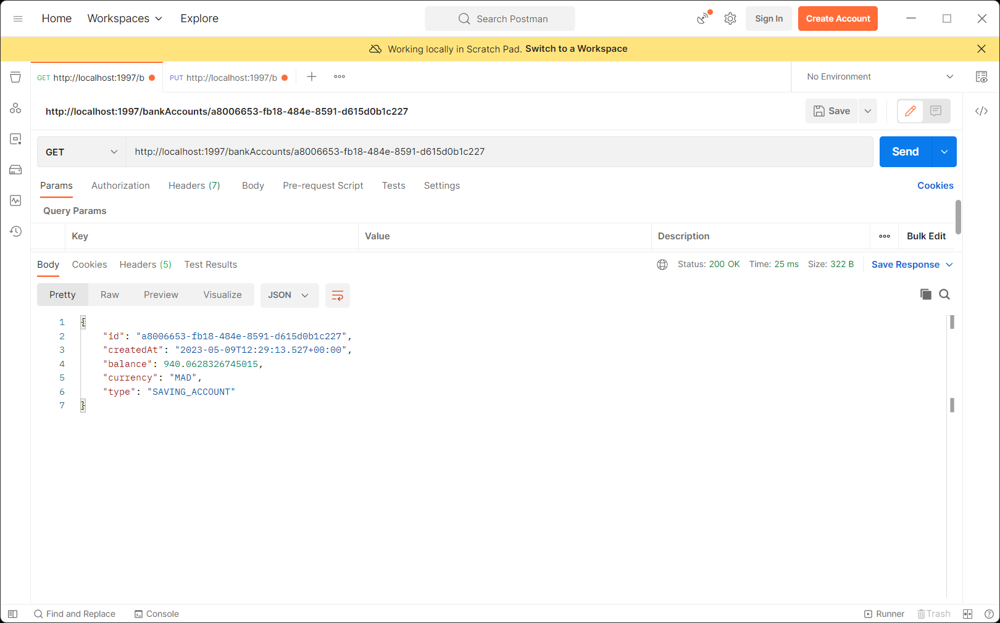
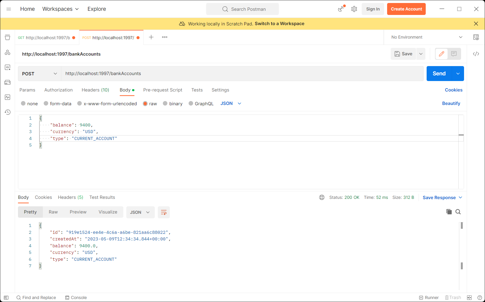
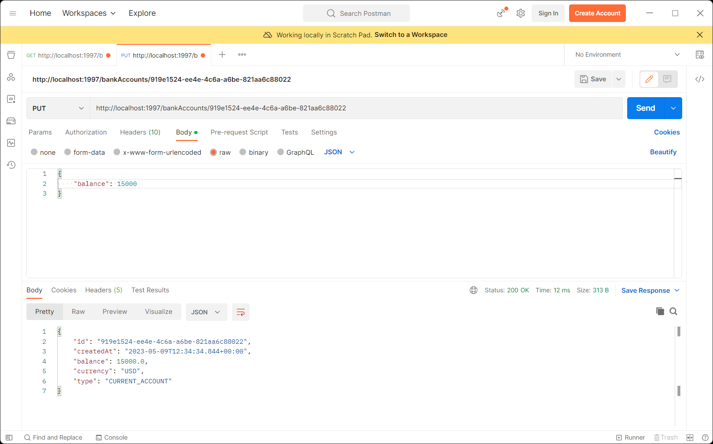

### 3. Génération et teste de la documentation Swagger des API Rest du Web service
* L'interface Swagger obtenu du lien http://localhost:1997/swagger-ui/
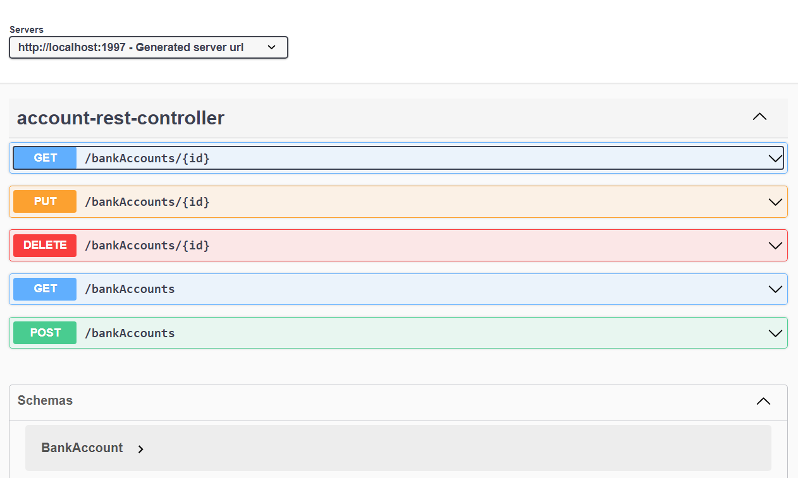
* La documentation genere par Swagger du lien http://localhost:1997/v3/api-docs
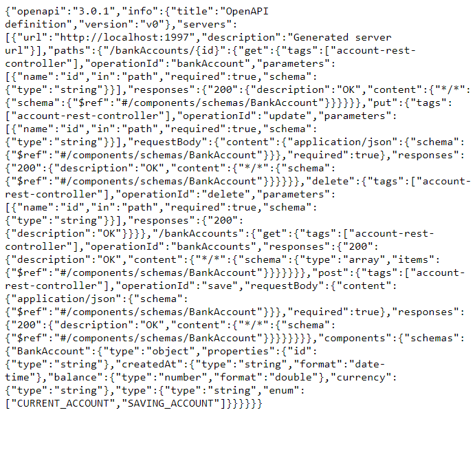
* Liste des clients en utilisant Swagger 
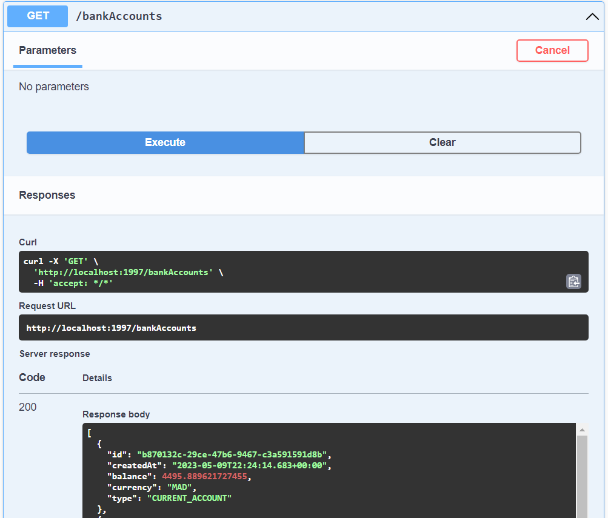
* Importer la documentation Swagger envers Postman
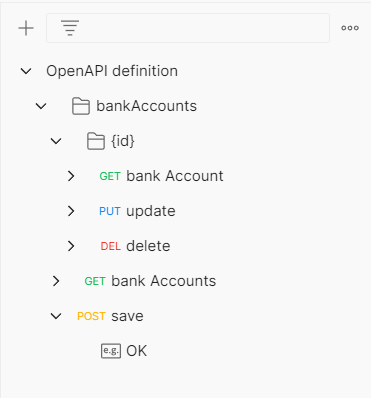

### 4. Exposer une API Restful en utilisant Spring Data Rest en exploitant des projections
* Liste des clients en utilisant Spring Data Rest
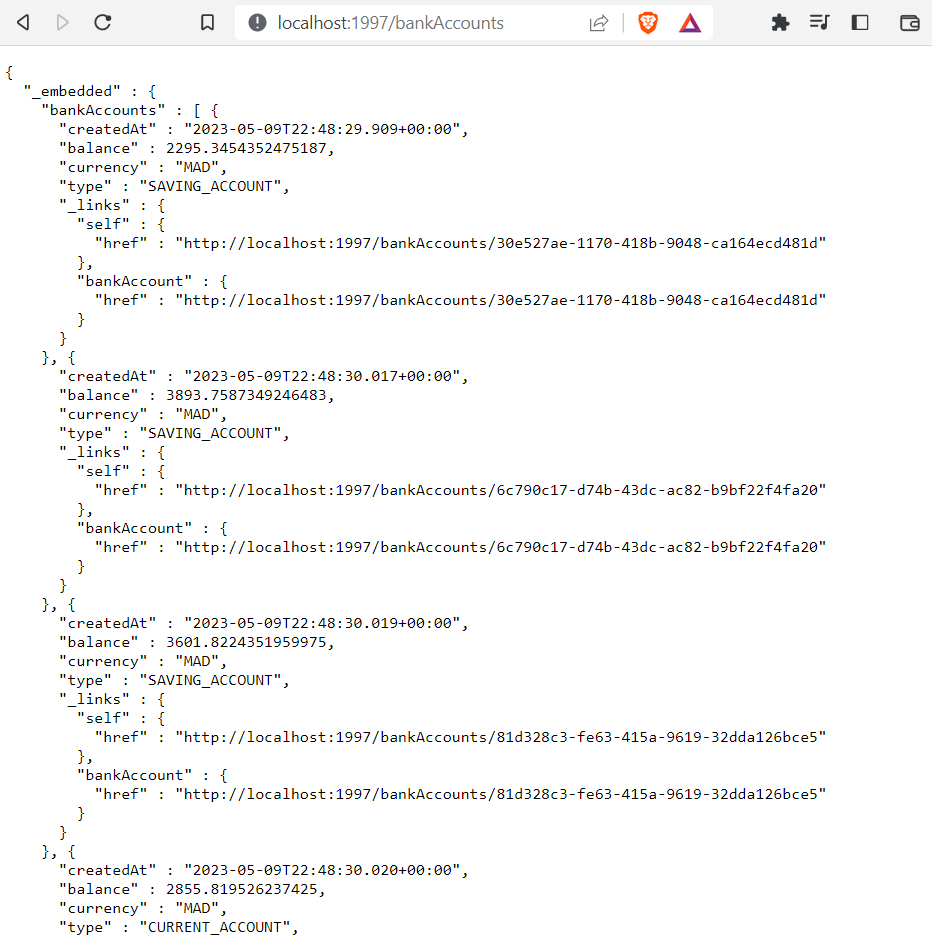
* Obtention d'un client a partir de son id 
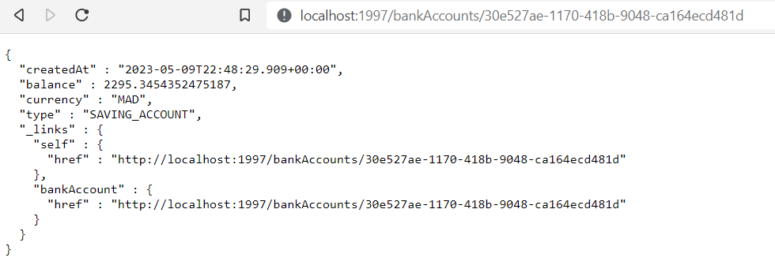
* Liste des clients par leurs type de compte par le lien http://localhost:1997/bankAccounts/search/findByType?type=CURRENT_ACCOUNT
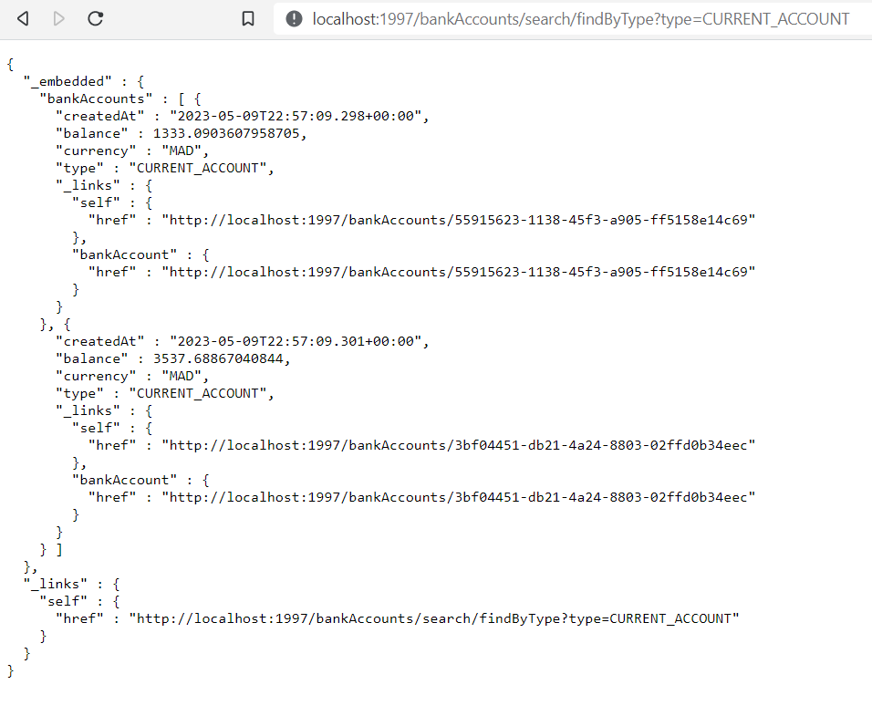
* Liste des clients avec la projection "p1" du lien http://localhost:1997/bankAccounts?projection=p1
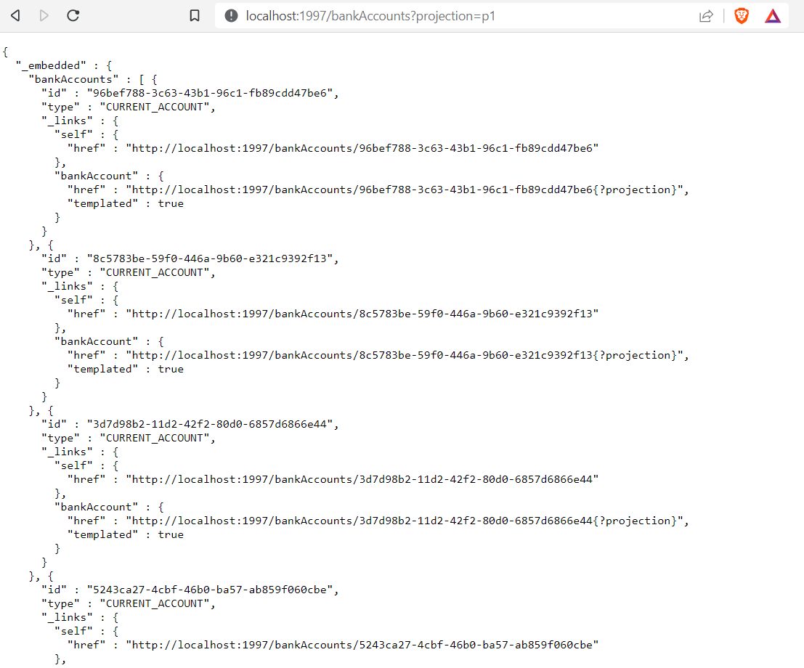

### 5. Création de la couche Service (métier) et du micro service en utilisant les DTOs et Mappers
### 6. Création un Web service GraphQL