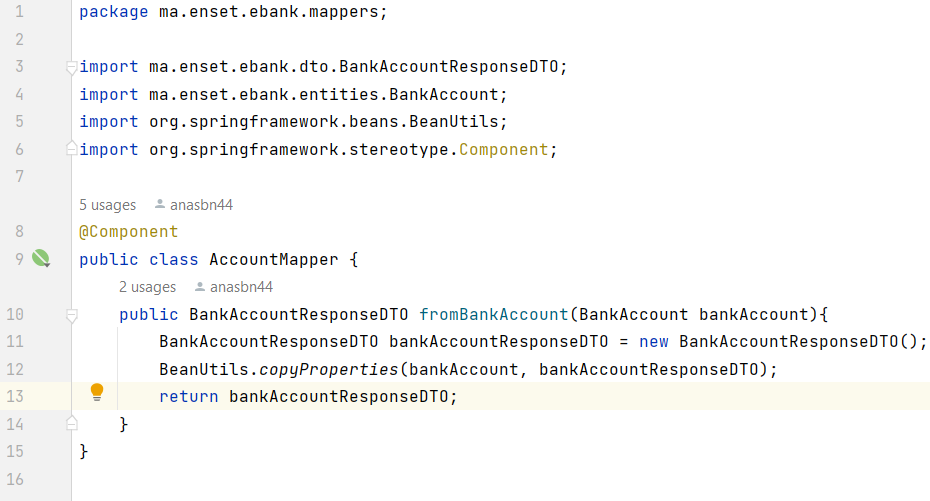

# Architectures Micro-services

### 1. Teste de la couche DAO
A partir du lien http://localhost:1997/h2-console on génére l'interface de la base de données. La figure suivante présente cette interface.

### 2. Teste du web micro-service en utilisant un client REST comme Postman
La figure ci-dessus représente la liste des clients générés en utilisant REST, elle est accessible via le lien http://localhost:1997/bankAccounts.

Avec le logiciel Postman nous permettant de tester les différentes fonctions du REST. Les figures qui suient présentent les différentes fonctions comme obtenir la liste des clients ou un client à partir de son id, ainsi qu'ajouter ou modifier un client.

### 3. Génération et teste de la documentation Swagger des API Rest du Web service
* Interface Swagger obtenu du lien http://localhost:1997/swagger-ui/

* Documentation généré par Swagger du lien http://localhost:1997/v3/api-docs

* Liste des clients en utilisant Swagger 

* Importqtion de la documentation Swagger envers Postman

### 4. Exposer une API Restful en utilisant Spring Data Rest en exploitant des projections
* Liste des clients en utilisant Spring Data Rest

* Obtention d'un client à partir de son id 

* Liste des clients par leurs type de compte par le lien http://localhost:1997/bankAccounts/search/findByType?type=CURRENT_ACCOUNT

* Liste des clients avec la projection "p1" du lien http://localhost:1997/bankAccounts?projection=p1

### 5. Création les DTOs et Mappers et de la couche Service (métier) du micro service
* Les DTOs

* Les Mappers

* Les services

### 6. Création un Web service GraphQL
* Affichage de la liste des comptes en utilisant la fonction accountsList de type query

* Affichage d'un compte par son id en utilisant la fonction accountById de type query

* Affichage du cas d'erreur où le id est invalide 

* Ajout d'un compte en utilisant des variables

* Confirmation de l'ajout

* Modification d'un compte en utilisant des variables

* Suppression d'un compte

* Affichage de la base de données avec les relations entre Customer et BankAccount

* Affichage de la liste des comptes avec les nom de leurs Customers

* Affichage de la liste des customers avec le solde de leurs comptes

